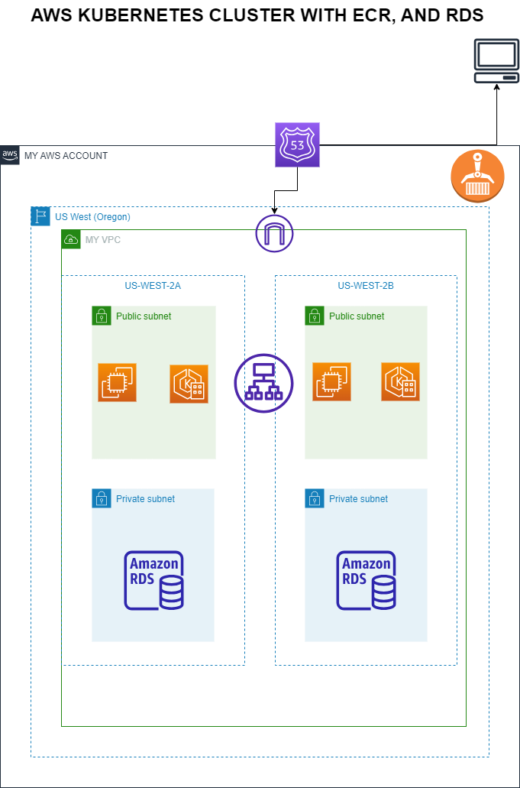

## Infrastructure Setup Documentation

### Objective:

This documentation provides clear and concise steps to set up an Amazon Elastic Kubernetes Service (EKS) cluster, a private Docker registry using Elastic Container Registry (ECR), and a MySQL database using Amazon RDS with Terraform. The infrastructure setup will be deployed on AWS.

### Prerequisites:

1. An AWS account with sufficient permissions to create EKS clusters, ECR repositories, and RDS instances.

2. Terraform installed on your local machine (https://www.terraform.io/downloads.html).

3. AWS CLI configured with valid access and secret keys (https://docs.aws.amazon.com/cli/latest/userguide/cli-configure-quickstart.html).

### Step-by-Step Setup:

Step 1: Set Variables 
Edit the variables.tf file to set desired values for the variables. The variables include:

- `aws_region`: The AWS region where resources will be created.
- `eks_cluster_name`: The name of the Amazon EKS cluster.
- `vpc_cidr_block`: The CIDR block for the Amazon VPC.
- `subnet_cidr_blocks`: The list of CIDR blocks for the subnets in at least two different AZs.

Step 2: Initialize Terraform
Run the following command to initialize Terraform in the directory:
`terraform init`

Step 3: Plan Infrastructure
Run the following command to review the execution plan and verify the resources that will be created:
`terraform plan`

Step 4: Apply Infrastructure
Apply the Terraform configuration to create the EKS cluster, ECR repository, and MySQL database:
`terraform apply --auto-approve`

Step 5: Access Outputs
After Terraform successfully applies the configuration, it will output important information, including the EKS cluster endpoint, ECR repository URL, and MySQL database endpoint.

- To interact with the EKS cluster, configure kubectl with the EKS cluster credentials:
`aws eks --region <aws_region> update-kubeconfig --name <eks_cluster_name>`

- To push and pull Docker images from the ECR repository, use the AWS CLI with Docker:
`aws ecr get-login-password --region <aws_region> | docker login --username AWS --password-stdin <ecr_repository_url>`

- To connect to the MySQL database, use the endpoint provided with the specified username and password.

Step 6: Cleanup 
If you want to tear down the resources created by Terraform, run the following command:
`terraform destroy --auto-approve`

### Conclusion:
This documentation outlines the steps to set up an AWS infrastructure using Terraform, including the creation of an EKS cluster, ECR repository, and MySQL database. Following the steps mentioned above will enable you to deploy a scalable and manageable Kubernetes cluster with the required components for storing Docker images and hosting a MySQL database.

---------------------------------------------------------

### Assumptions:

- AWS Account: The user has access to an AWS account with sufficient permissions to create and manage EKS clusters, ECR repositories, and RDS instances.

- Terraform and AWS CLI: The user has installed Terraform and AWS CLI on their local machine.

- Single Region Deployment: The setup assumes that all resources, including the EKS cluster, ECR repository, and RDS instance, will be created in a single AWS region.

### Design Choices:

- Single EKS Cluster: The implementation assumes a single EKS cluster to host the application workloads. For multi-cluster scenarios, you can modify the Terraform configuration accordingly or use Terraform modules for better organization.

- Private ECR Repository: The design choice is to create a private ECR repository to store Docker images securely. Private repositories provide access control, image versioning, and vulnerability scanning.

- MySQL Database: The setup includes an Amazon RDS instance running MySQL for the database needs. For production scenarios, consider using encryption and backups to ensure data security and recovery options.

- Default VPC and Subnet CIDR Blocks: The implementation uses default VPC and subnet CIDR blocks to keep the example simple. In a real-world scenario, you may want to define custom VPC and subnet configurations based on your specific requirements and security considerations.

### Additional Considerations:

- High Availability: The setup does not include high availability features like multi-AZ deployment for the EKS cluster and the RDS instance. For production environments, ensure you plan for high availability to prevent single points of failure.

- Network Security: In a production environment, implement appropriate network security measures using Security Groups and Network Access Control Lists (NACLs) to control inbound and outbound traffic.

- IAM Roles: The setup assumes that the required IAM roles for EKS and ECR have already been created or are managed separately. For production, ensure IAM roles have the least privilege principle applied.

- Cluster Autoscaler and Node Groups: For better scalability, consider setting up the Kubernetes Cluster Autoscaler and using managed node groups or self-managed nodes for the EKS cluster.

- Data Backup and Disaster Recovery: In production environments, implement data backup and disaster recovery solutions for the MySQL database.

- Monitoring and Logging: Consider setting up monitoring and logging solutions to collect, analyze, and visualize cluster metrics, application logs, and system logs.

### Note: This implementation is a basic example to demonstrate the setup of an EKS cluster, ECR repository, and RDS instance using Terraform.

